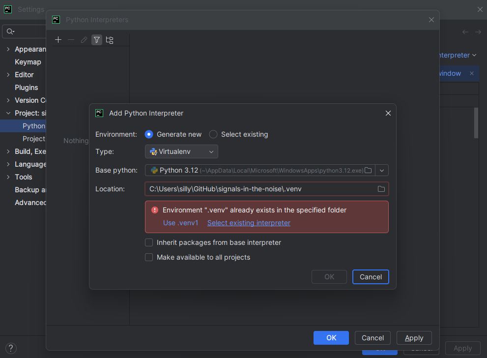

# Signals in the Noise
## Contents
* [Overview](#overview)
* [Getting Started](#getting-started)
* [Running Jupyter Notebooks](#running-jupyter-notebooks)
* [References](#references)

## Overview
Understanding the biological significance of low RNA profile cells in tumors has lagged behind advances in single-cell RNA sequencing (scRNA-seq)1. While technologies have enabled detailed characterization of tumor ecosystems [1,2], cells exhibiting low overall RNA counts have often been treated as technical artifacts and excluded from analyses [3]. This approach risks overlooking rare or quiescent cell states that may hold critical biological importance, particularly in understanding cancer dormancy and resistance [4, 5]

We hypothesize that low RNA profile cells are not merely technical noise but instead have biological significance.

_[Back to Top](#contents)_
## Getting Started

### 1. Prerequisites
* Python 3.12 or higher
* `pip` installed
### 2. Clone the repository 
```bash
   git clone https://github.com/caffiendFrog/signals-in-the-noise.git
   cd signals-in-the-noise
```
### 3. Activate virtual environment for isolation
* Windows (CMD or Powershell)
```bash
    python -m venv .venv
  .venv\Scripts\activate
```
* macOS/Linux
```bash
    python3 -m venv .venv
    source .venv/bin/activate
```
* PyCharm (_verified on PyCharm 2025.1.2, Windows 11 Home_)
  * Project Settings -> Python Interpreters -> Add Python Interpreter -> Local Interpreter
    * Select `.venv` (matching above activation environment)
    
### 4. Install runtime dependencies
```bash
    .\bin\install_dependencies.py
```
* NOTE: this has not been verified on a Mac, but should work if  
### 5. Install package in editable mode
_This will allow using the source code in the jupyter notebooks._
```bash
    pip install -e
```
### 6. Download the datasets
We will be using [GSE161529](https://www.ncbi.nlm.nih.gov/geo/query/acc.cgi?acc=GSE161529) [6, 7]. The datasets are prohibitively large to store in GitHub. Datasets can be downloaded directly from the Gene Expression Omnibus (GEO) or by using the provided python script which will download the files to the `assets` directory and expand the `tar` file for the patient samples. Using the python script will ensure compatibility with the rest of the downstream workflow (e.g. file naming conventions and locations).
```bash
  .\bin\download_datasets.py
```

_[Back to Top](#contents)_

## Running Jupyter Notebooks
Jupyter notebooks must be started within the virtual environment. See `notebooks/test_imports.ipynb` for how to import source code.
* Window (CMD or Powershell), macOS/Linux
  * After activating the virtualenv, you should see `(.venv)` prefixed to your command line.
  * Start jupyter notebooks you normally would.
* PyCharm 2025.1.2
  * If you have the pro version or on a trial that allows interacting directly with jupyter notebooks, be sure to select your activated virtual environment as the interpreter.

_[Back to Top](#contents)_

## References
1. Han, Ya, Wang, Yuting, Dong, Xin, Sun, Dongqing, Liu, Zhaoyang, Yue, Jiali, Wang, Haiyun, Li, Taiwen, Wang, Chenfei. TISCH2: expanded datasets and new tools for single-cell transcriptome analyses of the tumor microenvironment. Nucleic acids research. England: Oxford University Press; 2023;51(D1):D1425–D1431.
2. Sun, Dongqing, Wang, Jin, Han, Ya, Dong, Xin, Ge, Jun, Zheng, Rongbin, Shi, Xiaoying, Wang, Binbin, Li, Ziyi, Ren, Pengfei, Sun, Liangdong, Yan, Yilv, Zhang, Peng, Zhang, Fan, Li, Taiwen, Wang, Chenfei. TISCH: a comprehensive web resource enabling interactive single-cell transcriptome visualization of tumor microenvironment. Nucleic acids research. England: Oxford University Press; 2021;49(D1):D1420–D1430.
3. Young, Matthew D, Behjati, Sam. SoupX removes ambient RNA contamination from droplet-based single-cell RNA sequencing data. Gigascience. United States: Oxford University Press; 2020;9(12).
4. Lindell, Emma, Zhong, Lei, Zhang, Xiaonan. Quiescent Cancer Cells-A Potential Therapeutic Target to Overcome Tumor Resistance and Relapse. International journal of molecular sciences. Switzerland: MDPI AG; 2023;24(4):3762-.
5. Yeh, Albert C, Ramaswamy, Sridhar. Mechanisms of Cancer Cell Dormancy--Another Hallmark of Cancer? Cancer research (Chicago, Ill). United States; 2015;75(23):5014–5022.
6. Pal B, Chen Y, Vaillant F, Capaldo BD et al. A single-cell RNA expression atlas of normal, preneoplastic and tumorigenic states in the human breast. EMBO J 2021 Jun 1;40(11):e107333
7. Chen Y, Pal B, Lindeman GJ, Visvader JE et al. R code and downstream analysis objects for the scRNA-seq atlas of normal and tumorigenic human breast tissue. Sci Data 2022 Mar 23;9(1):96.

_[Back to Top](#contents)_