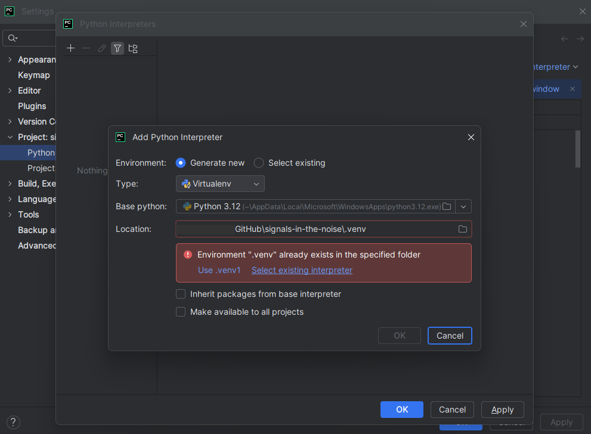

<h1>
  
  Signals in the Noise
</h1>

## Contents
* [Overview](#overview)
  * [Motivation](#motivation) 
* [Getting Started](#getting-started)
  * [Repository Structure](#repository-structure) 
  * [Running Jupyter Notebooks](#running-jupyter-notebooks)
* [References](#references)

## Overview
Understanding the biological significance of low RNA profile cells in tumors has lagged behind advances in single-cell RNA sequencing (scRNA-seq). While technologies have enabled detailed characterization of tumor ecosystems [1,2], cells exhibiting low overall RNA counts have often been treated as technical artifacts and excluded from analyses [3]. This approach risks overlooking rare or quiescent cell states that may hold critical biological importance, particularly in understanding cancer dormancy and resistance [4, 5]

We hypothesize that low RNA profile cells are not merely technical noise but instead have biological significance.

To that end, we leverage the supplementary data to recreate the preprocessing the authors performed. Specifically, we will annotate the sequencing data with a boolean flag indicating if the cell was considered a technical artifact (noise) or not.

_[Back to Top](#contents)_

### Motivation
When preparing data for use, there are assumptions about what is considered viable (“good”) and not viable (“noise”) data. Throughout the coursework here, the examples have been grounded in well understood domains, and so the assumptions are fairly sound. For example, if a large dataset has timestamps, and we know the time frame the data was collected, it is clear that data points with timestamps outside the timeframe are incorrect. When I began researching single cell RNA sequencing data, one thing that stood out to me were the assumptions used for preparing the data. Standard operating procedures have various guidelines that are followed to determine the viability of the sequencing data for a cell, attributing non-viability to technical challenges. Some of these include, if there is no expression at all (empty cell), too many genes detected (doublet), too few genes detected (ambient), to name a few. It struck me as hubris to assume that our understanding of biology is sufficient to make these assumptions. While I do understand that it may be necessary to analyze the two cell populations separately, for example examining all of them together dilutes any signals and reduces the diagnostic efficacy, completely throwing away the data points feels wrong. I don’t believe anyone has done a rigorous analysis of these data points. When doing research for the causal analysis earlier this year, I came across a review [6] discussing the DNA damage response with respect to the resistance of cancer stem cells. As I read about the DNA damage response (DDR), it occurred to me that it is a kind of biological quality control system. It identifies cells that are not viable and attempts to repair them. From the discussion in the review: “Increased DDR may reflect poor clinical outcome in certain categories of patients..” and “... in other groups of patients somatic DDR alteration is associated with improved clinical outcomes..”. In other words, cells that are deemed not viable (e.g. need to be repaired) may have diagnostic importance. This is my motivation for performing an analysis on the sequencing data that would normally be considered not viable and filtered out from downstream analyses.

_[Back to Top](#contents)_

## Getting Started
1. Prerequisites
   * Python 3.12 or higher
   * `pip` installed
2. Clone the repository
    ```bash
       git clone https://github.com/caffiendFrog/signals-in-the-noise.git
       cd signals-in-the-noise
    ```
3. Activate virtual environment for isolation
   * Windows (CMD or Powershell)
    ```bash
        python -m venv .venv
      .venv\Scripts\activate
    ```
  * macOS/Linux
    ```bash
        python3 -m venv .venv
        source .venv/bin/activate
    ```
  * PyCharm (_verified on PyCharm 2025.1.2, Windows 11 Home_)
    * Project Settings -> Python Interpreters -> Add Python Interpreter -> Local Interpreter
      * Select `.venv` (matching above activation environment)

4. Install runtime dependencies
    ```bash
        python .\bin\install_dependencies.py
    ```
    * NOTE: this has not been verified on a Mac, but should work if  

5. Install package in editable mode
    ```bash
        pip install -e .
    ```
   * _This will allow using the source code in the jupyter notebooks._

6. Download the datasets
    ```bash
        python .\bin\download_datasets.py
    ```
   * We will be using [GSE161529](https://www.ncbi.nlm.nih.gov/geo/query/acc.cgi?acc=GSE161529) [7, 8]. The datasets are prohibitively large to store in GitHub. Datasets can be downloaded directly from the Gene Expression Omnibus (GEO) or by using the provided python script which will download the files to the `assets` directory and expand the `tar` file for the patient samples. Using the python script will ensure compatibility with the rest of the downstream workflow (e.g. file naming conventions and locations).

_[Back to Top](#contents)_

### Repository Structure

* `bin`
  * Contains various scripts
* `data`
  * Data in various stages of preprocessing
  * Recommended to mark this directory as excluded from indexing in IDE.
* `images`
  * Images used in documentation 
* `notebook`
  * Jupyter notebooks (the analysis)
* `resources`
  * Additonal resources for the data
  * Recommended to mark this directory as excluded from indexing in IDE.
* `src`
  * Source directory

_[Back to Top](#contents)_

### Running Jupyter Notebooks
Jupyter notebooks must be started within the virtual environment.
* Window (CMD or Powershell), macOS/Linux
  * After activating the virtualenv, you should see `(.venv)` prefixed to your command line.
  * Start jupyter notebooks you normally would.
* PyCharm 2025.1.2
  * If you have the pro version or on a trial that allows interacting directly with jupyter notebooks, be sure to select your activated virtual environment as the interpreter.

_[Back to Top](#contents)_

## References
1. Han, Ya, Wang, Yuting, Dong, Xin, Sun, Dongqing, Liu, Zhaoyang, Yue, Jiali, Wang, Haiyun, Li, Taiwen, Wang, Chenfei. TISCH2: expanded datasets and new tools for single-cell transcriptome analyses of the tumor microenvironment. Nucleic acids research. England: Oxford University Press; 2023;51(D1):D1425–D1431.
2. Sun, Dongqing, Wang, Jin, Han, Ya, Dong, Xin, Ge, Jun, Zheng, Rongbin, Shi, Xiaoying, Wang, Binbin, Li, Ziyi, Ren, Pengfei, Sun, Liangdong, Yan, Yilv, Zhang, Peng, Zhang, Fan, Li, Taiwen, Wang, Chenfei. TISCH: a comprehensive web resource enabling interactive single-cell transcriptome visualization of tumor microenvironment. Nucleic acids research. England: Oxford University Press; 2021;49(D1):D1420–D1430.
3. Young, Matthew D, Behjati, Sam. SoupX removes ambient RNA contamination from droplet-based single-cell RNA sequencing data. Gigascience. United States: Oxford University Press; 2020;9(12).
4. Lindell, Emma, Zhong, Lei, Zhang, Xiaonan. Quiescent Cancer Cells-A Potential Therapeutic Target to Overcome Tumor Resistance and Relapse. International journal of molecular sciences. Switzerland: MDPI AG; 2023;24(4):3762-.
5. Yeh, Albert C, Ramaswamy, Sridhar. Mechanisms of Cancer Cell Dormancy--Another Hallmark of Cancer? Cancer research (Chicago, Ill). United States; 2015;75(23):5014–5022.
6. Abad, Etna, Graifer, Dmitry, Lyakhovich, Alex. DNA damage response and resistance of cancer stem cells. Cancer letters. Ireland: Elsevier B.V; 2020;474:106–117. 
7. Pal B, Chen Y, Vaillant F, Capaldo BD et al. A single-cell RNA expression atlas of normal, preneoplastic and tumorigenic states in the human breast. EMBO J 2021 Jun 1;40(11):e107333 
8. Chen Y, Pal B, Lindeman GJ, Visvader JE et al. R code and downstream analysis objects for the scRNA-seq atlas of normal and tumorigenic human breast tissue. Sci Data 2022 Mar 23;9(1):96.

_[Back to Top](#contents)_